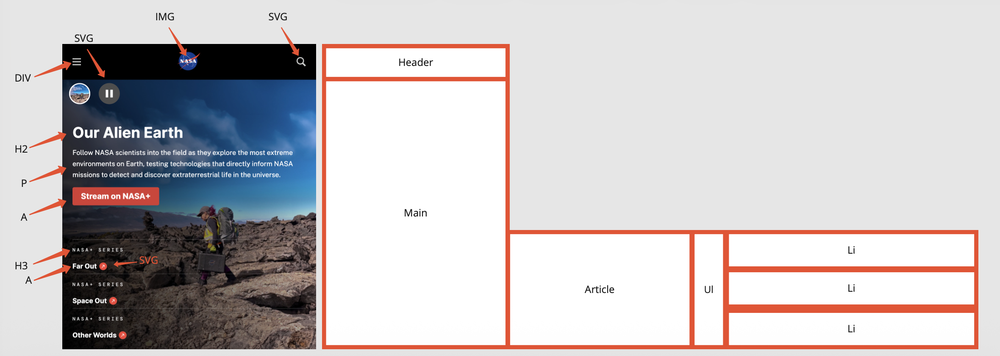

# Procesverslag
Markdown is een simpele manier om HTML te schrijven.  
Markdown cheat cheet: [Hulp bij het schrijven van Markdown](https://github.com/adam-p/markdown-here/wiki/Markdown-Cheatsheet).

Nb. De standaardstructuur en de spartaanse opmaak van de README.md zijn helemaal prima. Het gaat om de inhoud van je procesverslag. Besteedt de tijd voor pracht en praal aan je website.

Nb. Door *open* toe te voegen aan een *details* element kun je deze standaard open zetten. Fijn om dat steeds voor de relevante stuk(ken) te doen.

## Jij

  
uitwerken voor kick-off werkgroep

  ### Auteur:
  Joost Stoelinga

  #### Je startniveau:
  Blauwe pisten

  #### Je focus:
  Ik ga me focussen op 'responsive'
 

## Je website

  
uitwerken voor kick-off werkgroep

  ### Je opdracht:
  https://www.nasa.gov/

  #### Screenshot(s) van de eerste pagina (small screen): 
  Homescreen 
  

  #### Screenshot(s) van de tweede pagina (small screen):
  Universe  
  
 

## Toegankelijkheidstest 1/2 (week 1)

  
uitwerken na test in 2e werkgroep

  ### Bevindingen
  Lijst met je bevindingen die in de test naar voren kwamen:

Content

Het is hier en daar nodig om lastige tekst en woorden te gebruiken om de content te duiden die word weergegeven op de website. Dit zit hem in de wetenschappelijke aard van de pagina. Verder vind ik het niet echt toegankelijk dat er images gebruikt worden als link. Voor de images is wel een alternatieve link beschikbaar maar het had extra toegankelijk geweest.

Global code

Ik heb via [validator W3c](https://validator.w3.org/nu/?doc=https%3A%2F%2Fwww.nasa.gov%2F) de website van NASA gevalideerd en hieruit bleek dat er 318 error’s stonden in de HTML en CSS van de website. Verder had ik zelf niet veel aan te merken op de Global code.

Keyboard

Geen notes

Mobile & Touch

Geen notes

Headings

De Headings op de NASA website kloppen niet helemaal. Zo kon in nergens een H1 vonden (vermoedelijk de IMG van het logo). Verder kwam ik enkel H2 elementen tegen en geen H1 of H2.

Lists

Geen notes

Images

Op het gebied van de Images is de website van NASA ook niet compatibel met de W3c standaard. Zo heb ik gezien dat de Alt omschrijving vaak wel aanwezig is maar geen duidelijke omschrijving geeft van de content. Bijvoorbeeld, er stond een afbeelding van een berg met daarbij de Alt text: Tips for star viewing from NASA. Verder stond er geen text in images. Alleen worder er wel veel images als linkjes gebruikt.

Media (Video & Audio)

Ik heb niet veel video’s of audio elementen gevonden op de website van NASA maar waar ze wel gebruikt werden stonden de animaties vaak wel op autoplay. Wanneer dit gebeurde konden deze wel gepauzeerd worden. 

Controls

Op het gebied van controls was ik wel vrij tevreden over de toegankelijkheid. Alleen de IMG’s als links die ik al eerder aanhield zijn niet top.

Appearance

De website van NASA bied geen light & Dark mode of high-contrast mode aan. De 200% increase zoom ziet er wel goed uit.

Animations

De animaties die gebruikt werden op de website zijn subtiel en te pauzeren.

## Breakdownschets (week 1)

  
uitwerken na afloop 3e werkgroep

  ### de hele pagina: 
  
  
  
  
  

  ### dynamisch deel (bijv menu): 
  

  ### wellicht nog een dynamisch deel (bijv filter): 
  

## Voortgang 1 (week 2)

  
uitwerken voor 1e voortgang

  ### Stand van zaken
  - ik heb in de footer de HTML opgeschoond en zodat ik deze beter kan aanspreken in CSS. Voorheen had ik gebruik gemaakt van articles, ul en li. Nu heb ik het alsnog gedaan met ul en li items maar deze zijn nu als child van de section gestructureerd.

  ### Agenda voor meeting
  samen met je groepje opstellen

student 1 (Ik zelf)
- kijken naar de vormgeving van mijn header en footer.
- een gradient toevoegen op mijn images waardoor de tekst beter te lezen is.
- een responsive carousel maken

Student 2 (Julia van Walderveen)
- youtube filmpje
- moet mijn hele footer uitgewerkt

Student 3 (Melissa Aksoy)
- checken of mijn HTML juist is en wat ik kan verbeteren. als er tijd is, kijkje naar hoe ik css zou moeten uitwerken

  ### Verslag van meeting
  hier na afloop snel de uitkomsten van de meeting vastleggen
1. Eerst hebben we gechecked of mijn HTML semantisch klopte. Op de meeste plekken klopte dit best wel goed. Ik kreeg alleen als feedback dat het slimmer is om alle Li's op een apparte regel moest schrijven zoals hieronder:

        <nav>            
                    <ul>
                        <li>
                            <a>Explore</a>
                        </li>

Dit om de leesbaarheid van de code beter te maken en zo is het niet gewoon een blok code zonder logica.

2. Verder had ik een aantal vragen over de styling van mijn Header & Footer. Helaas zijn we hier niet meer aan toe gekomen omdat we vooral op HTLM gefocussed waren. Dus deze vragen heb ik even geparkeerd voor de volgende les en voortgangsgesprek.

## Voortgang 2 (week 3)

  
uitwerken voor 2e voortgang

  ### Stand van zaken

  ### Agenda voor meeting
  samen met je groepje opstellen

  - joost | - Ik wil graag kijken hoe ik mijn nav kan vormgeven als een responsive raster
            - Daarnaast wil ik nog ff kijken naar mijn grid en hoe ik daarin dingen kan gaan plaatsen

  - Aya | - hier wil ik het straks over hebben Of het toegestaan is om 2 images binnen 1 artickel te hebben, waarvan 1 als achtergrond img.2 images op de echte website met de juiste kleur downloaden en hoe ik de contrast van socialmedia iconen met css kan laten veranderen
          - wil de rest dat hier nog ff kort vertellen zodat iedereen het in zijn/haar readme kan verwerken 
 

  ### Verslag van meeting
  hier na afloop snel de uitkomsten van de meeting vastleggen

  - Patoune | - X
  - Aya | - Of het toegestaan is om 2 images binnen 1 article te hebben, waarvan 1 als achtergrond img.
            - 2 images op de echte website met de juiste kleur downloaden.
            - Hoe ik de contrast van socialmedia iconen met css kan laten veranderen.
  - Joost | - Hoe ik mijn nav kan vormgeven als een responsive raster.
            - Kijken naar mijn grid en hoe ik daarin dingen kan gaan plaatsen
  - Kyra | - Afbeeldingen positioneren op mijn home page en hoe ik dat in een grid kan doen.
            - Hoe ik de animatie het best kan maken.

## Toegankelijkheidstest 2/2 (week 4)

  
uitwerken na test in 9e werkgroep

  ### Bevindingen
  Lijst met je bevindingen die in de test naar voren kwamen (geef ook aan wat er verbeterd is):

Content

Ik heb op sommige plekken de texten aangepast om beter aante sluiten bij een brederen doelgroep. Toch is het vaak ook nodig om de wetenschappelijke namen te laten staan. Voor de rest was de content op de website al goed en heb ik hier niet veel aan hoeven te veranderen.

Global code

Ik heb via de W3C extentie in VS code mijn HTML laten vaildaten en deze waren gef geen error's. Op dit punt heb ik de website van NASA verbeterd.

Keyboard

Op mijn pagina is alles te bedien met de TAB. Dit is ook het geval op de pagina van NASA.

Mobile & Touch

Op de Universe pagina van NASA is een groot stuk horiziontal scrolling zichtbaar bij de kleinste breete. Dit heb ik op mijn pagina verbeterd.

Headings

Op de pagina van NASA werd geen H1 element gebruikt. Ik heb deze wel. Hij is alleen niet zichtbaar op de pagina zelf. verder heb ik ook gebruik gemaakt van H2 en H3 elementen. Deze heeft NASA ook niet concistent gebruikt.

Lists

Geen notes

Images

Op heb gebied van Images heb ik de pagina van de NASA een helehoop kunnen verbeteren. Zo heeft mijn pagina bij alle images een duidelijke ALT text die aansluit bij de afbeelding. Helaas had ik geen images die als text werden gebruikt. Dit heb ik dus niet kunnen verbeteren.

Media (Video & Audio)

Helaas is het mij niet gelukt om mijn video te pauzeren. 

Controls

Bij mij zijn alle Images die linkjes zijn ook met de tab functie te berijken. Op de pagina van NASA was die niet altijd het geval.

Appearance

Ik heb een Light/ dark mode toegevoegd aan mijn pagina. Deze neemt de voorkeur van de gebruiker over. De website van NASA heeft dit niet.

Animations

De animaties die gebruikt werden op de website zijn subtiel en te pauzeren.

## Voortgang 3 (week 4)

  
uitwerken voor 3e voortgang

  ### Stand van zaken
  hier dit ging goed & dit was lastig (neem ook screenshots op van delen van je website en code)

  ### Agenda voor meeting
  - Kyra
  heeey guys, beetje laat maar dit was nog van vorige keer wat ik wilde bespreken: de afbeeldingen positioneren op mijn home page en hoe ik dat in een grid kan doen. En hoe ik de animatie het best kan maken.

  En voor morgen wil ik graag weten hoe ik mijn search balk in mijn hamburger menu krijg en hoe ik onderin mijn pagina de cursor kan laten meebewegen en hoe ik als je over bepaalde knoppen hovered er een soort bolletje te zien is.
 
  - Aya
  hier wil ik het straks over hebben Of het toegestaan is om 2 images binnen 1 artickel te hebben, waarvan 1 als achtergrond img.2 images op de echte website met de juiste kleur downloaden en hoe ik de contrast van socialmedia iconen met css kan laten veranderen
 
  wil de rest dat hier nog ff kort vertellen zodat iedereen het in zijn/haar readme kan verwerken 

## Eindgesprek (week 5)

  
uitwerken voor eindgesprek

  ### Je uitkomst - karakteristiek screenshots:
  

  ### Dit ging goed/Heb ik geleerd: 
  Omdat ik vorig jaar al heel ver was gekomen en eigenlijk al heel veel kon en begreep kon ik me deze periode vooral gaan focussen op het verbeteren en afmaken van mijn website. Dit was een groot voordeel maar ergens ook een nadeel omdat ik een aantal opdrachten om deze reden heb overgeslagen in de les terwijl ik achteraf wel wat opversing van de materie kon gebruiken. Ondanks dat ben ik heel tevereden m et mijn eindresulktaat. 

  Een onderdeel waarop ik tenopzichten van vorig jaar enorm ben verbeterd is het positioneren. Zo gebruiken ik niet alleen absolute pistioneren maar maak ik ook veel meer gebruik van grid en flex. 

  Daarnaast ben ik ook veel beter geworden in het leren begrijpen van mijn eigen code en het de-coden van mijn eigen geschreven code door gebruik te maken van de inspecteren functie in Chrome.

  ### Dit was lastig/Is niet gelukt:
  Zoals ik net al aangaf heb ik een aantal opdrachten overgeslagen waardoor het toepassen op mijn eigen website lastig werd. Een voorbeeld hiervan is bijvoorbeeld het hamburger menu. Deze was erg lastig. 

  Verder had ik ook moeite om mijn code van vorig jaar goed te begrijpen. Omdat ik mijn CSS code heel erg rommelig had geschreven was het heel moeilijk om hier weer goed in te komen en daarom koste het me heel veel tijd om dit weer op te ruimen. Toen ik dit eenmaal had opgeruimd ging het wel veel beter.

  

## Bronnenlijst

  
continu bijhouden terwijl je werkt

  Nb. Wees specifiek ('css-tricks' als bron is bijv. niet specifiek genoeg). 
  Nb. ChatGpT en andere AI horen er ook bij.
  Nb. Vermeld de bronnen ook in je code.

  1. bron 1
  2. bron 2
  3. ...

